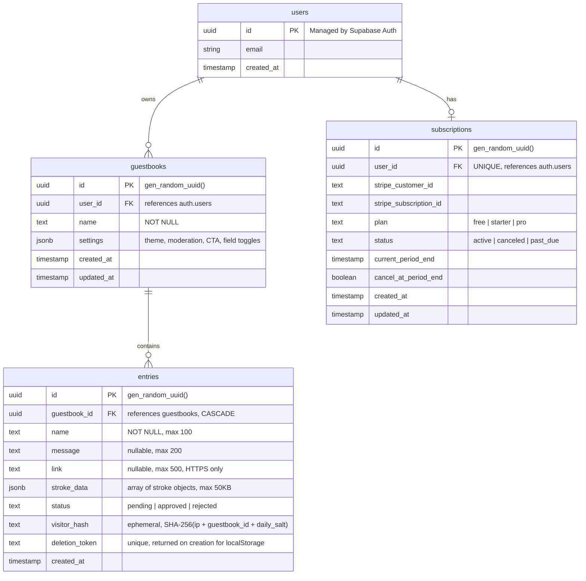

# Build SignBoard — Embeddable Hand-Drawn Guestbook Widget

## Overview

SignBoard is an embeddable guestbook widget where website visitors leave hand-drawn signatures, doodles, and short messages. Two sides: a **dashboard** (Next.js web app) where owners manage guestbooks, and a **widget** (lightweight embeddable JS) that lives on the owner's website.

The product fills the gap between sterile testimonial tools (Senja, Famewall) and forgettable comment boxes (123Guestbook). It targets indie creators, designers, developers, and portfolio owners who want personality on their websites.

---

## Revision Summary

Key changes from review agents:

| Review Agent | Critical Changes |
|---|---|
| **Security** | No client-generated SVG storage (XSS), remove public INSERT RLS, `import 'server-only'` on admin client, Stripe raw body + idempotency, HTTPS-only links, Upstash Redis rate limiting |
| **Simplification** | Merge sdk+widget-core into one chunk, store only `stroke_data` (render SVG client-side), Open Shadow DOM, cut redo/word-filter/stroke-timestamps, static theme preview, localStorage deletion tokens |
| **Performance** | SVG as `` data URIs (not inline), cap DPR at 2, debounced masonry, 100-entry render cap, 50KB stroke limit, pause polling in background tabs, partial DB index |
| **TypeScript** | `shared/types/` directory, strongly-typed Supabase `<Database>`, typed fetch wrapper, `as const satisfies` for plans, `#private` fields in widget class, `readonly` undo stack |
| **UI Library** | Base UI (`@base-ui/react`) for headless primitives, react-colorful for color picker, TanStack Table for moderation, Sonner for toasts |
| **Architecture** | Thin repository layer for data access, Open Shadow DOM confirmed, `/api/v1/` versioning |

---

## Technical Approach

### Architecture

```
┌─────────────────────────────────────────────────────────────┐
│                     Host Website                             │
│                                                              │
│  <div data-sb-id="abc123">                                   │
│    ┌──── Open Shadow DOM ─────────────────────┐              │
│    │  <style> widget CSS </style>              │              │
│    │  <div class="sb-root">                    │              │
│    │    ├── Masonry Wall (SVG  entries)    │              │
│    │    ├── "Sign the Guestbook" Button         │              │
│    │    └── Drawing Panel (lazy loaded)         │              │
│    └───────────────────────────────────────────┘              │
│                                                              │
│  <script> inline snippet (~500B) → loads widget.js async     │
│           + <link rel="preconnect"> to API domain            │
└──────────────────────┬───────────────────────────────────────┘
                       │ fetch()
                       ▼
┌──────────────────────────────────────────────────────────────┐
│             Next.js API Routes (Vercel)                       │
│                                                              │
│  /api/v1/guestbooks/[id]          → GET config               │
│  /api/v1/guestbooks/[id]/entries  → GET entries, POST entry   │
│  /api/billing/checkout             → Stripe Checkout           │
│  /api/billing/portal               → Stripe Portal             │
│  /api/webhooks/stripe              → Stripe webhooks           │
│                                                              │
│  ├── CORS middleware (widget API)                             │
│  ├── Rate limiting (Upstash Redis, hashed IP)                │
│  ├── Honeypot validation                                     │
│  ├── Input sanitization                                      │
│  └── Security headers (CSP, X-Frame-Options, etc.)           │
└──────────────────────┬───────────────────────────────────────┘
                       │ supabaseAdmin (service role, 'server-only')
                       ▼
┌──────────────────────────────────────────────────────────────┐
│                      Supabase                                 │
│                                                              │
│  ├── Auth (email/password signup, sessions)                   │
│  ├── PostgreSQL (guestbooks, entries, subscriptions)          │
│  └── (No Storage bucket needed — SVG rendered client-side)    │
└──────────────────────────────────────────────────────────────┘
```

### Key Architecture Decisions

- **Open Shadow DOM** (not Closed): Easier debugging, better accessibility tool support, browser DevTools access. Style isolation is still maintained — open mode just allows external JS access to the shadow tree, which is acceptable for a widget.
- **No Supabase Realtime in widget**: Widget polls GET entries every 30s. Keeps bundle tiny (no WebSocket library). Polling pauses when tab is hidden.
- **No Supabase Storage bucket**: Removed. SVG is rendered client-side from `stroke_data` JSONB. No server-side SVG generation, no thumbnail storage.
- **Repository layer**: Thin data access layer between API routes and Supabase for testability and clean separation.
- **All entry inserts via service role**: No public INSERT RLS policy. All writes go through API routes with validation, rate limiting, and the service role client.

### Tech Stack

| Layer | Technology | Rationale |
|-------|-----------|-----------|
| Dashboard | Next.js 15 (App Router) + TypeScript | SSR, file-based routing, Vercel-native |
| UI Components | Base UI (`@base-ui/react`) | Headless, accessible, unstyled — full control over styling with Tailwind |
| Color Picker | react-colorful (~3KB) | Tiny, zero-dep, perfect for theme editor |
| Data Tables | TanStack Table | Headless, type-safe, pairs with Base UI |
| Toasts | Sonner | Lightweight, beautiful, works with Next.js |
| Styling | Tailwind CSS v4 | Rapid UI development |
| Backend/DB | Supabase (PostgreSQL + Auth) | All-in-one, generous free tier |
| Rate Limiting | Upstash Redis | Serverless-native, global, per-route limits |
| Widget | Vanilla TypeScript, Open Shadow DOM | Framework-free for <50KB target |
| Widget Build | Vite (library mode, IIFE output) | Tree shaking, code splitting, tiny output |
| Drawing | `perfect-freehand` (~2KB) + HTML5 Canvas | Natural stroke feel, pressure simulation |
| Payments | Stripe (Checkout + Customer Portal + Webhooks) | Industry standard |
| Hosting | Vercel | Native Next.js support, Edge CDN |

---

## Database Schema (ERD)



### Changes from original schema

- **Removed `svg_path`**: Client-generated SVG is an XSS vector. SVG is now rendered client-side from `stroke_data` using `stroke-to-svg.ts`.
- **Removed `thumbnail_url`**: No server-side thumbnails. SVG `` data URIs are generated client-side.
- **Added `deletion_token`**: Unique token returned on entry creation, stored in visitor's localStorage. Enables self-service deletion without accounts.
- **Changed `visitor_hash`**: Now uses a daily-rotating salt (ephemeral) — not permanent PII. Auto-expires for GDPR compliance.
- **Added `link` validation**: HTTPS-only URLs enforced at API layer.
- **Stroke data limit**: 50KB max (was 500KB). Enforced at API layer.

### Database Indexes

```sql
-- Partial index for widget queries (only approved entries)
CREATE INDEX idx_entries_approved ON entries (guestbook_id, created_at DESC)
WHERE status = 'approved';

-- Index for moderation queries
CREATE INDEX idx_entries_guestbook_status ON entries (guestbook_id, status, created_at DESC);

-- Index for rate limiting lookups
CREATE INDEX idx_entries_visitor_hash ON entries (visitor_hash, created_at DESC);
```

### Settings JSONB Structure

```typescript
// All fields optional in storage — merged with DEFAULT_SETTINGS at read time
interface GuestbookSettings {
  // Theme
  background_color?: string;       // hex or "transparent"
  card_background_color?: string;
  text_color?: string;
  accent_color?: string;
  font?: "handwriting" | "sans" | "mono";
  card_border_radius?: number;     // px
  canvas_background_color?: string;

  // Behavior
  moderation_mode?: "auto_approve" | "manual_approve";
  cta_text?: string;               // default: "Sign the Guestbook"
  max_entries_displayed?: number;   // 50, 100, or -1 (unlimited)
  show_link_field?: boolean;
  show_message_field?: boolean;
}

const DEFAULT_SETTINGS: Required<GuestbookSettings> = {
  background_color: "transparent",
  card_background_color: "#ffffff",
  text_color: "#1a1a1a",
  accent_color: "#6366f1",
  font: "handwriting",
  card_border_radius: 12,
  canvas_background_color: "#ffffff",
  moderation_mode: "auto_approve",
  cta_text: "Sign the Guestbook",
  max_entries_displayed: 50,
  show_link_field: true,
  show_message_field: true,
} as const;
```

**Change**: All settings fields are now optional with `DEFAULT_SETTINGS` for merging. Removed `word_filter_enabled` (YAGNI — not building a word filter for MVP).

### Stroke Data JSONB Structure

```typescript
interface DrawingData {
  version: 1;
  width: number;              // canvas logical width
  height: number;             // canvas logical height
  strokes: ReadonlyArray<{
    points: ReadonlyArray<readonly [x: number, y: number, pressure: number]>;
    color: string;
    size: number;
    // Removed: timestamp (YAGNI — replay is Phase 4, add then)
  }>;
}
```

**Changes**: Removed `timestamp` from strokes (replay is Phase 4, add the field when needed). Used `readonly` arrays for immutability. Named tuple elements for clarity. Coordinates quantized to integers at capture time.

### Row Level Security (RLS) Policies

| Table | Policy | Rule |
|-------|--------|------|
| guestbooks | Owner read/write | `auth.uid() = user_id` |
| entries | Public read (approved) | `status = 'approved'` (no auth required) |
| entries | ~~Public insert~~ | **REMOVED** — all inserts via API routes using service role |
| entries | Owner moderate | Owner can update status via guestbook ownership subquery |
| entries | Owner delete | Same ownership subquery |
| subscriptions | Owner read | `auth.uid() = user_id` |
| subscriptions | Service role write | Webhook handler uses service role (bypasses RLS) |

**Critical security change**: Removed public INSERT policy on entries. All entry creation goes through `/api/v1/guestbooks/[id]/entries` POST route, which uses `supabaseAdmin` (service role). This ensures rate limiting, honeypot, validation, and sanitization cannot be bypassed.

---

## Project Structure

```
signboard/
├── src/
│   ├── app/                           # Next.js App Router
│   │   ├── (auth)/                    # Auth routes (no dashboard layout)
│   │   │   ├── login/page.tsx
│   │   │   ├── signup/page.tsx
│   │   │   └── layout.tsx
│   │   ├── (dashboard)/               # Dashboard routes (sidebar layout)
│   │   │   ├── guestbooks/
│   │   │   │   ├── page.tsx           # List guestbooks
│   │   │   │   ├── new/page.tsx       # Create guestbook
│   │   │   │   └── [id]/
│   │   │   │       ├── page.tsx       # Guestbook overview + embed code
│   │   │   │       ├── entries/page.tsx    # Moderation queue
│   │   │   │       ├── theme/page.tsx      # Theme customization + static preview
│   │   │   │       └── settings/page.tsx   # Behavior settings
│   │   │   ├── billing/page.tsx       # Subscription management
│   │   │   └── layout.tsx             # Dashboard sidebar layout
│   │   ├── api/
│   │   │   ├── v1/                    # Widget-facing API (public, CORS)
│   │   │   │   └── guestbooks/
│   │   │   │       └── [id]/
│   │   │   │           ├── route.ts           # GET config
│   │   │   │           └── entries/route.ts   # GET entries, POST entry
│   │   │   ├── billing/
│   │   │   │   ├── checkout/route.ts
│   │   │   │   └── portal/route.ts
│   │   │   └── webhooks/
│   │   │       └── stripe/route.ts
│   │   ├── layout.tsx                 # Root layout
│   │   └── page.tsx                   # Landing/marketing page
│   │
│   ├── components/
│   │   ├── ui/                        # Custom UI components (styled with Tailwind, built on Base UI)
│   │   ├── guestbook/
│   │   │   ├── guestbook-card.tsx
│   │   │   ├── entry-card.tsx
│   │   │   ├── moderation-table.tsx   # TanStack Table for moderation
│   │   │   ├── theme-editor.tsx       # Color pickers + static preview card
│   │   │   └── embed-code.tsx         # Copy-to-clipboard embed snippet
│   │   └── billing/
│   │       ├── pricing-table.tsx
│   │       └── subscription-status.tsx
│   │
│   ├── lib/
│   │   ├── supabase/
│   │   │   ├── client.ts              # Browser Supabase client (createBrowserClient<Database>)
│   │   │   ├── server.ts              # Server component Supabase client (createServerClient<Database>)
│   │   │   ├── admin.ts               # Service role client — import 'server-only'
│   │   │   └── middleware.ts          # Auth middleware helper
│   │   ├── repositories/              # Thin data access layer
│   │   │   ├── guestbook.repo.ts      # Guestbook CRUD operations
│   │   │   ├── entry.repo.ts          # Entry CRUD + moderation queries
│   │   │   └── subscription.repo.ts   # Subscription lookups + upserts
│   │   ├── stripe/
│   │   │   ├── client.ts              # Stripe SDK instance
│   │   │   └── config.ts             # Plan definitions, feature gates (as const satisfies)
│   │   └── utils/
│   │       ├── hash.ts                # IP hashing for rate limiting (daily salt rotation)
│   │       ├── rate-limit.ts          # Upstash Redis rate limiter
│   │       └── sanitize.ts            # Input sanitization + link validation
│   │
│   └── shared/                        # Types shared between dashboard + widget
│       └── types/
│           ├── database.ts            # Supabase generated types (npx supabase gen types)
│           ├── guestbook.ts           # GuestbookSettings, DEFAULT_SETTINGS
│           ├── drawing.ts             # DrawingData, stroke types
│           ├── api.ts                 # Widget API request/response types
│           └── index.ts               # Re-exports
│
├── widget/                            # Standalone widget (separate build)
│   ├── src/
│   │   ├── widget.ts                  # Entry point: loader, discovery, Shadow DOM, wall, API
│   │   ├── drawing/
│   │   │   ├── canvas.ts              # Drawing canvas (pointer events, strokes, DPR cap 2)
│   │   │   ├── stroke-to-svg.ts       # Convert stroke data → SVG path d attribute
│   │   │   └── colors.ts             # Pen color/thickness presets
│   │   ├── masonry.ts                 # Lightweight masonry layout (debounced, transform-based)
│   │   ├── api.ts                     # Typed fetch wrapper (Result<T, E> discriminated union)
│   │   ├── modal.ts                   # Drawing modal/overlay
│   │   └── styles.css                 # Widget CSS (inlined at build via ?inline)
│   ├── vite.config.ts                 # Library mode: IIFE entry + dynamic import for drawing
│   ├── tsconfig.json                  # References shared/types
│   └── package.json
│
├── supabase/
│   ├── migrations/
│   │   ├── 20260216000001_create_guestbooks.sql
│   │   ├── 20260216000002_create_entries.sql    # Includes partial indexes
│   │   └── 20260216000003_create_subscriptions.sql
│   └── config.toml
│
├── .env.local                         # Environment variables (gitignored)
├── middleware.ts                       # Next.js middleware (auth + security headers)
├── next.config.ts
├── tailwind.config.ts
├── tsconfig.json
├── package.json
└── README.md
```

### Key structural changes

- **Merged `sdk.ts` + `widget-core.ts` → `widget.ts`**: Single entry point handles loader, discovery, Shadow DOM, wall rendering, and API. Eliminates the sdk→widget-core waterfall.
- **Removed `widget/src/undo-redo.ts`**: Undo is a simple array pop on the strokes array. No redo (YAGNI for MVP).
- **Removed `widget/src/accessibility.ts`**: ARIA labels and keyboard nav are inlined into the components that need them (widget.ts, modal.ts, canvas.ts). Not a separate module.
- **Removed `src/hooks/use-realtime-entries.ts`**: Dashboard uses `router.refresh()` after mutations. Widget uses polling. No Supabase Realtime subscription needed.
- **Added `src/lib/repositories/`**: Thin data access layer between routes/components and Supabase.
- **Added `src/shared/types/`**: Types shared between dashboard and widget builds.
- **Added `src/lib/utils/rate-limit.ts`**: Upstash Redis rate limiter.
- **Removed `src/lib/utils/word-filter.ts`**: YAGNI for MVP.
- **Removed `supabase/migrations/..._create_storage_buckets.sql`**: No storage bucket needed.
- **Added `@base-ui/react`**: Headless UI primitives as npm dependency (not copy-paste like shadcn).

---

## Implementation Phases

### Phase 1: Foundation (Infrastructure + Auth + Data Layer)

**Goal**: Project scaffolded, database set up, auth working, basic guestbook CRUD with Base UI + Tailwind dashboard.

#### Tasks

- [ ] **1.1 Project setup** `package.json, tsconfig.json, next.config.ts, tailwind.config.ts`
  - Initialize Next.js 15 with App Router + TypeScript
  - Install core deps: `@supabase/supabase-js`, `@supabase/ssr`, `stripe`, `tailwindcss`
  - Install Base UI: `npm install @base-ui/react`
  - Install additional: `react-colorful`, `@tanstack/react-table`, `sonner`
  - Install rate limiting: `@upstash/ratelimit`, `@upstash/redis`
  - Configure Tailwind, ESLint, Prettier
  - Set up `.env.local` with Supabase + Stripe + Upstash keys
  - Configure TypeScript paths for `shared/types` in both root and widget tsconfigs

- [ ] **1.2 Supabase project setup**
  - Create Supabase project
  - Run migrations to create tables: `guestbooks`, `entries`, `subscriptions`
  - Create partial indexes: `idx_entries_approved`, `idx_entries_guestbook_status`, `idx_entries_visitor_hash`
  - Enable RLS on all tables with policies per revised schema (**no public INSERT on entries**)
  - Generate TypeScript types: `npx supabase gen types typescript --project-id <id> > src/shared/types/database.ts`

- [ ] **1.3 Supabase client utilities** `src/lib/supabase/`
  - Browser client: `createBrowserClient<Database>()` for client components
  - Server client: `createServerClient<Database>()` for server components (uses `await cookies()`)
  - Admin client: `import 'server-only'` guard, service role key, for API routes only
  - Auth middleware helper for `middleware.ts`

- [ ] **1.4 Repository layer** `src/lib/repositories/`
  - `guestbook.repo.ts`: `list(userId)`, `get(id)`, `create(userId, name)`, `update(id, settings)`, `delete(id)`
  - `entry.repo.ts`: `listApproved(guestbookId, cursor, limit)`, `listAll(guestbookId, status?, cursor)`, `create(data)`, `updateStatus(id, status)`, `bulkUpdateStatus(ids, status)`, `delete(id)`, `deleteByToken(token)`
  - `subscription.repo.ts`: `get(userId)`, `upsert(data)`, `downgrade(userId)`

- [ ] **1.5 Rate limiting utility** `src/lib/utils/rate-limit.ts`
  - Upstash Redis-based rate limiter
  - Sliding window: 3 entries/hour per visitor hash per guestbook
  - Separate limit for API reads: 60 requests/minute per IP
  - Helper: `rateLimit(identifier, limit, window)`

- [ ] **1.6 Auth middleware** `middleware.ts`
  - Refresh Supabase auth session on every request
  - Protect `/guestbooks/*` and `/billing` routes (redirect to `/login` if unauthenticated)
  - Exclude `/api/v1/*` and `/api/webhooks/*` from auth (public widget API)
  - Security headers on all responses: `X-Content-Type-Options`, `X-Frame-Options`, `Referrer-Policy`

- [ ] **1.7 Auth pages** `src/app/(auth)/login/page.tsx, signup/page.tsx`
  - Email/password signup form (Base UI `Field` + `Input` + custom Button)
  - Email/password login form
  - Password reset flow
  - Redirect to `/guestbooks` on success

- [ ] **1.8 Dashboard layout** `src/app/(dashboard)/layout.tsx`
  - Custom sidebar with navigation: Guestbooks, Billing (Tailwind-styled)
  - User info + logout button in sidebar footer
  - Responsive: sidebar collapses on mobile (Base UI `Collapsible` or custom)
  - Sonner `Toaster` provider in root layout

- [ ] **1.9 Guestbook CRUD** `src/app/(dashboard)/guestbooks/`
  - List page: card grid showing all guestbooks with entry counts
  - Create page: Base UI `Dialog` with name input, creates guestbook with `DEFAULT_SETTINGS`
  - Guestbook detail page: overview with entry count, embed code snippet, Base UI `Tabs` navigation
  - Delete guestbook: Base UI `AlertDialog` confirmation

- [ ] **1.10 Embed code generation** `src/components/guestbook/embed-code.tsx`
  - Generate the `<div>` + `<script>` snippet with the guestbook ID
  - Include `<link rel="preconnect">` to API domain in snippet
  - One-click copy to clipboard (button with copy icon)
  - Instructions for common platforms (generic HTML, WordPress, Webflow, Framer)

### Phase 2: Widget Core (Wall + Drawing + Submission)

**Goal**: Build the embeddable widget that visitors interact with.

#### Tasks

- [ ] **2.1 Widget build setup** `widget/vite.config.ts, widget/package.json`
  - Vite library mode, IIFE output for main entry
  - Two chunks only: `widget.js` (IIFE entry), `drawing.js` (dynamic import on interaction)
  - CSS inlined via `import styles from './styles.css?inline'`
  - `bundlesize` check in CI: fail if >50KB total gzipped
  - Per-chunk budgets: `widget.js` <20KB, `drawing.js` <12KB, CSS <5KB
  - Target: ES2020 (modern browsers only)
  - tsconfig references `shared/types` via path alias

- [ ] **2.2 Widget typed API client** `widget/src/api.ts`
  - Typed `fetch` wrapper returning `Result<T, E>` discriminated union
  - `fetchConfig(guestbookId)`: GET config + theme
  - `fetchEntries(guestbookId, cursor?)`: GET approved entries (cursor pagination)
  - `submitEntry(guestbookId, data)`: POST new entry, returns `{ id, deletion_token }`
  - `deleteEntry(guestbookId, entryId, token)`: DELETE entry via deletion token
  - ETag support for conditional GET requests (entries polling)
  - Shared types imported from `shared/types/api.ts`

- [ ] **2.3 Widget-facing API routes** `src/app/api/v1/guestbooks/[id]/`
  - `GET /api/v1/guestbooks/[id]` — return guestbook config (theme + settings merged with `DEFAULT_SETTINGS`)
  - `GET /api/v1/guestbooks/[id]/entries` — return approved entries (cursor pagination, limit 20). ETag header for conditional requests. Returns `stroke_data` (not SVG).
  - `POST /api/v1/guestbooks/[id]/entries` — submit new entry:
    - Use `supabaseAdmin` (service role) for insert — **no public INSERT RLS**
    - Upstash Redis rate limit check (3/hr per visitor hash)
    - Honeypot validation (silently accept, don't store)
    - Input sanitization (strip HTML, enforce length limits)
    - Link validation: HTTPS-only, reject `javascript:`, `data:`, relative URLs
    - Stroke data validation: reject if >50KB, validate structure, cap stroke count, quantize coordinates to integers
    - Generate `deletion_token` (crypto.randomUUID()), return to client
    - `visitor_hash`: SHA-256(IP + guestbook_id + daily_salt) — ephemeral
    - Use `await params` (Next.js 15) and `await headers()` for IP
  - `DELETE /api/v1/guestbooks/[id]/entries/[entryId]` — delete entry via deletion token in request body
  - CORS headers on all responses (allow any origin)
  - OPTIONS preflight handler

- [ ] **2.4 Widget core** `widget/src/widget.ts`
  - Self-executing: discovers `[data-sb-id]` elements on DOMContentLoaded
  - IntersectionObserver for lazy loading (200px rootMargin)
  - Attach **Open Shadow DOM** to host element
  - Use ECMAScript `#private` fields for internal state (runtime privacy)
  - Inject scoped CSS (from `styles.css?inline`)
  - Skeleton rendering before data loads (from same chunk, no network)
  - **Parallel loading**: fetch config + entries concurrently after IntersectionObserver fires
  - Space reserved (min-height set, prevents CLS)
  - Render masonry wall of entries
  - "Sign the Guestbook" button (CTA text from config)
  - Empty state ("Be the first to sign!")
  - Error state (graceful fallback if API unavailable — widget hides, not broken)
  - Polling: re-fetch entries every 30s. Pause when `document.hidden`. Use ETag for conditional requests.
  - ARIA labels on button, wall container

- [ ] **2.5 Masonry layout** `widget/src/masonry.ts`
  - Lightweight JS masonry (~50 lines)
  - Responsive: 1 col (<480px), 2 cols (<768px), 3 cols (<1024px), 4 cols (>1024px)
  - ResizeObserver with **debounce** (150ms) for dynamic reflow
  - Use CSS `transform` for positioning (batch DOM writes, avoid layout thrashing)
  - Cap rendered entries at **100** — show "View more on SignBoard" link for overflow
  - Slight randomness in card sizing for organic feel (seeded from entry ID, not random per render)

- [ ] **2.6 Entry cards** (within widget.ts)
  - SVG drawing rendered as **`` with SVG data URI** (not inline SVG — prevents XSS, better performance)
  - `stroke-to-svg.ts` generates SVG string → `data:image/svg+xml;charset=utf-8,` URI → ``
  - Explicit `width` and `height` on `` (prevents layout shift)
  - Name displayed below
  - Message shown on hover/tap (tooltip or expand)
  - Clickable cards (with link) open in new tab with `rel="noopener noreferrer"`
  - Subtle link indicator icon
  - Gentle fade-in animation via CSS transition

- [ ] **2.7 Drawing canvas** `widget/src/drawing/canvas.ts`
  - HTML5 Canvas with Pointer Events API
  - `perfect-freehand` for natural strokes with `simulatePressure: true`
  - Pen color presets (8 colors): black, dark gray, blue, red, green, purple, orange, pink
  - Pen thickness toggle: thin (4px), medium (8px), thick (14px)
  - Undo button (stroke-level: `strokes.pop()`) — **no redo** (YAGNI for MVP)
  - Clear button (clears all strokes)
  - Keyboard shortcut: Ctrl/Cmd+Z undo
  - **DPR capped at 2** (prevents massive canvas on 3x/4x displays)
  - Mobile: `touch-action: none`, `{ passive: false }` preventDefault
  - Mobile: body scroll lock when drawing modal is open
  - Mobile: single pointer tracking (reject multi-touch)
  - Mobile: higher smoothing/streamline values for finger drawing
  - Quantize coordinates to integers at capture time (reduces stroke_data size)
  - Enforce limits: max 100 strokes, max 5000 points total

- [ ] **2.8 Stroke to SVG conversion** `widget/src/drawing/stroke-to-svg.ts`
  - Convert `perfect-freehand` outline points to SVG path `d` attribute
  - Quadratic bezier through midpoints for smooth curves
  - Generate complete SVG string with viewBox from canvas dimensions
  - Round coordinates to **integers** (not decimals) for size optimization
  - Used both for display on wall (`` data URI) and for submission preview

- [ ] **2.9 Drawing modal** `widget/src/modal.ts`
  - Opens on "Sign the Guestbook" click
  - Drawing canvas (centerpiece)
  - Name field (required, max 100 chars)
  - Message field (optional, max 200 chars) — toggleable per guestbook config
  - Link field (optional, max 500 chars) — toggleable per guestbook config
  - Honeypot field (hidden, invisible to users)
  - Submit button with loading state
  - Close button / click-outside-to-close / Escape key
  - Success state: brief confirmation, store `deletion_token` in localStorage, modal closes
  - Error state (retry option)
  - Focus trap inside modal (keyboard nav)
  - ARIA: `role="dialog"`, `aria-modal="true"`, `aria-label`

- [ ] **2.10 Lazy loading entries** (within widget.ts)
  - Cursor-based pagination (fetch 20 at a time)
  - IntersectionObserver sentinel at bottom of wall
  - "Loading more..." indicator
  - Stop when no more entries (API returns null cursor)
  - Cap total rendered at 100 entries

### Phase 3: Dashboard Features (Moderation + Theme + Settings)

**Goal**: Build the dashboard experience for guestbook owners.

#### Tasks

- [ ] **3.1 Entry moderation page** `src/app/(dashboard)/guestbooks/[id]/entries/page.tsx`
  - **TanStack Table** with columns: drawing preview (SVG rendered from stroke_data), name, message, link, status badge, timestamp, actions
  - Filterable: All, Pending, Approved, Rejected tabs (Base UI `Tabs`)
  - Single approve/reject buttons per row
  - Bulk select (checkbox column) + bulk approve/reject (Base UI `Menu`)
  - Delete entry with confirmation (Base UI `AlertDialog`)
  - Spam indicators: badge on entries with same visitor_hash in short time window
  - Updates: use `router.refresh()` after mutations (no Supabase Realtime needed)

- [ ] **3.2 Theme customization page** `src/app/(dashboard)/guestbooks/[id]/theme/page.tsx`
  - Color pickers via **react-colorful**: background, card background, text, accent, canvas background
  - Font selector (Base UI `Select`): handwriting, sans-serif, monospace
  - Card border radius slider (Base UI `Slider` or native range input)
  - **Static preview card**: renders a sample entry card with current theme settings applied via inline styles. Not a full mini-widget — just a card showing how an entry will look.
  - Save button persists to guestbook settings JSONB via repository layer
  - Reset to defaults button (applies `DEFAULT_SETTINGS`)
  - Feature-gated: Free tier gets basic colors only; Starter+ gets full customization

- [ ] **3.3 Settings page** `src/app/(dashboard)/guestbooks/[id]/settings/page.tsx`
  - Custom CTA button text (Base UI `Input`)
  - Moderation mode toggle: auto-approve / manual approve (Base UI `Switch`)
  - Max entries displayed: 50 / 100 / unlimited (Base UI `Select`)
  - Show/hide link field toggle (Base UI `Switch`)
  - Show/hide message field toggle (Base UI `Switch`)
  - Feature-gated per plan (show upgrade prompts with CTA card)

- [ ] **3.4 Feature gating utility** `src/lib/stripe/config.ts`
  - `PLANS` object using `as const satisfies Record<PlanName, PlanConfig>`:
    ```typescript
    const PLANS = {
      free:    { guestbooks: 1,  entries: 50,        branding: true,  moderation: false, fullTheme: false },
      starter: { guestbooks: 3,  entries: Infinity,  branding: false, moderation: true,  fullTheme: true  },
      pro:     { guestbooks: -1, entries: Infinity,  branding: false, moderation: true,  fullTheme: true  },
    } as const satisfies Record<string, PlanConfig>;
    ```
  - `getUserPlan(userId)`: fetch subscription via repository, return plan name
  - `canAccess(feature, plan)`: check if feature is available for plan
  - Enforce limits: guestbook count, entry count, moderation access
  - Show upgrade prompts when hitting limits

### Phase 4: Polish + Production Readiness

**Goal**: All the states, loading indicators, error handling, and production hardening.

> **Note**: Billing (Stripe) moved to Phase 5. Get the core product polished first, then monetize.

#### Tasks

- [ ] **4.1 Loading states everywhere**
  - Dashboard: skeleton loaders for guestbook list, entry table, theme editor
  - Widget: shimmer skeleton before entries load (rendered from widget.ts, no network)
  - Drawing modal: submit button loading state
  - Billing page: loading states for checkout/portal redirect

- [ ] **4.2 Empty states**
  - No guestbooks: "Create your first guestbook" CTA with illustration
  - No entries: "Be the first to sign!" with prominent CTA button
  - No pending entries: "All caught up!" in moderation queue

- [ ] **4.3 Error states**
  - Widget: graceful fallback if API unreachable (widget hides itself, not broken page)
  - Dashboard: Sonner toast notifications for failed operations
  - Form validation errors inline (Base UI `Field` validation)
  - Stripe errors: clear messaging for failed payments

- [ ] **4.4 Widget polling for live updates**
  - Poll GET entries endpoint every 30 seconds
  - Pause polling when `document.hidden` (tab not visible)
  - Use ETag/If-None-Match for conditional requests (304 = no new data)
  - New entries animate onto wall with fade-in

- [ ] **4.5 "Powered by SignBoard" branding** (free tier)
  - Small, unobtrusive link at bottom of widget
  - Links to signboard.app
  - Removed for Starter+ plans (feature gate from config.ts)

- [ ] **4.6 Entry self-deletion** (privacy)
  - On entry creation, API returns `deletion_token`
  - Widget stores token in `localStorage` keyed by entry ID
  - If visitor has a token for an entry, show small "Remove" link on that entry card
  - Clicking "Remove" sends DELETE request with token → entry deleted immediately
  - No owner review needed — token proves ownership

- [ ] **4.7 Production hardening**
  - Upstash rate limiting on ALL API routes (not just widget submission)
  - Validate stroke data: reject payloads >50KB, max 100 strokes, max 5000 points
  - Link validation: HTTPS-only, reject `javascript:`, `data:` URIs
  - CORS: widget API allows any origin (guestbook ID in path validates access)
  - Security headers in middleware: `Content-Security-Policy`, `X-Content-Type-Options: nosniff`, `X-Frame-Options: DENY` (dashboard only), `Referrer-Policy: strict-origin-when-cross-origin`
  - Vercel environment variables for all secrets (no `.env` in production)
  - `import 'server-only'` on `admin.ts` to prevent client bundle inclusion

- [ ] **4.8 Widget cache headers** `vercel.json`
  - `widget.js`: `Cache-Control: public, max-age=3600, stale-while-revalidate=86400`
  - `drawing.js` (hashed filename): `Cache-Control: public, max-age=31536000, immutable`
  - Entry API: `Cache-Control: public, s-maxage=10, stale-while-revalidate=30` + ETag

### Phase 5: Billing (Stripe Integration)

**Goal**: Monetize with three tiers. Moved after Phase 4 so core product is polished before adding payment complexity.

#### Tasks

- [ ] **5.1 Stripe product setup** (manual in Stripe Dashboard)
  - Create products: Starter, Pro
  - Create prices: $7/mo ($70/yr) for Starter, $15/mo ($144/yr) for Pro
  - Configure Customer Portal (cancellation, plan changes)
  - Set up webhook endpoint in Stripe Dashboard

- [ ] **5.2 Billing page** `src/app/(dashboard)/billing/page.tsx`
  - Current plan display (card with badge)
  - Pricing table with all three tiers (card grid)
  - "Upgrade" button → creates Stripe Checkout session via API
  - "Manage Subscription" button → creates Stripe Customer Portal session
  - Current period end date, cancellation status

- [ ] **5.3 Checkout API** `src/app/api/billing/checkout/route.ts`
  - Validate authenticated user (`await cookies()` → Supabase session)
  - Create or retrieve Stripe customer via repository
  - Create Checkout Session with price ID
  - Return checkout URL

- [ ] **5.4 Customer Portal API** `src/app/api/billing/portal/route.ts`
  - Validate authenticated user
  - Look up Stripe customer ID via `subscription.repo.ts`
  - Create Portal session
  - Return portal URL

- [ ] **5.5 Stripe webhook handler** `src/app/api/webhooks/stripe/route.ts`
  - **Use `request.text()`** for raw body (not `request.json()` — Stripe signature verification needs raw string)
  - Verify webhook signature: `stripe.webhooks.constructEvent(rawBody, sig, secret)`
  - **Idempotency**: Check if event already processed (store `event.id` or use Stripe event timestamp)
  - Handle `checkout.session.completed` → upsert subscription record via `subscription.repo.ts`
  - Handle `customer.subscription.updated` → update plan/status
  - Handle `customer.subscription.deleted` → downgrade to free
  - Use `supabaseAdmin` (service role) for all DB writes
  - Log all events for debugging

---

## Widget Bundle Size Budget

| Chunk | Purpose | Target (gzipped) |
|-------|---------|-------------------|
| `widget.js` | Loader, discovery, Shadow DOM, masonry, wall rendering, API client, polling | 15-20KB |
| `drawing.js` | Canvas, perfect-freehand, stroke-to-SVG, modal, undo | 8-12KB |
| Inline CSS | All widget styles (via `?inline` import) | 3-5KB |
| **Total** | | **26-37KB** |

### Changes from original budget

- **Merged `sdk.js` (3-5KB) into `widget.js`**: Eliminates the waterfall of loading sdk.js first, then widget-core.js. One chunk does everything needed before user interaction.
- **Tighter total**: 26-37KB (was 29-42KB). Savings from removing undo-redo module, accessibility module, Realtime code, and SVG storage logic.

### Key size decisions

- No framework in widget (vanilla TypeScript)
- No Supabase JS SDK in widget (raw `fetch` to API routes)
- No `axios`, `lodash`, `date-fns` — use browser built-ins
- `perfect-freehand` is ~2KB gzipped — the only runtime dependency
- CSS inlined as string via Vite `?inline`, injected into Shadow DOM
- Drawing module loaded only on user interaction (dynamic `import()`)
- SVG rendering is pure string manipulation (no DOM parser needed in widget.js — only needed in drawing.js for preview)

---

## Widget Loading Sequence

```
1. Host page loads
2. Inline snippet executes (~0.5ms)
   └── <link rel="preconnect"> to API domain
   └── Creates command queue, starts async load of widget.js
3. widget.js loads (~15-20KB, CDN cached)
   └── Discovers [data-sb-id] elements
   └── Sets up IntersectionObserver on each (200px rootMargin)
4. Widget scrolls near viewport
   └── IntersectionObserver fires
   └── Open Shadow DOM attached, skeleton rendered (no network)
   └── Space reserved (min-height set, prevents CLS)
   └── Config + entries fetched IN PARALLEL (two concurrent fetch calls)
   └── Masonry wall rendered with SVG  entries
   └── Skeleton replaced with real content
   └── 30s polling loop starts (pauses when tab hidden)
5. User clicks "Sign the Guestbook"
   └── drawing.js loads (~8-12KB, dynamic import)
   └── Canvas initialized (DPR capped at 2), touch handlers attached
   └── Modal opens with focus trap
```

### Changes from original sequence

- **Eliminated step 3→5 waterfall**: No separate sdk.js → widget-core.js load. Single widget.js handles everything.
- **Parallel fetches**: Config and entries load concurrently (was sequential).
- **Preconnect**: DNS/TLS resolved before widget.js even loads.

---

## API Route Summary

### Widget-facing (public, CORS enabled, rate-limited via Upstash)

| Route | Method | Auth | Purpose |
|-------|--------|------|---------|
| `/api/v1/guestbooks/[id]` | GET | None | Fetch guestbook config/theme (merged with DEFAULT_SETTINGS) |
| `/api/v1/guestbooks/[id]/entries` | GET | None | Fetch approved entries with stroke_data (cursor pagination, ETag) |
| `/api/v1/guestbooks/[id]/entries` | POST | None | Submit new entry (rate-limited, honeypot, validated, returns deletion_token) |
| `/api/v1/guestbooks/[id]/entries/[entryId]` | DELETE | Deletion token | Delete own entry via localStorage token |

### Dashboard-facing (authenticated via Supabase cookies)

| Route | Method | Auth | Purpose |
|-------|--------|------|---------|
| `/api/billing/checkout` | POST | Cookies | Create Stripe Checkout session |
| `/api/billing/portal` | POST | Cookies | Create Stripe Customer Portal session |

### Webhooks

| Route | Method | Auth | Purpose |
|-------|--------|------|---------|
| `/api/webhooks/stripe` | POST | Stripe signature (`request.text()` for raw body) | Handle subscription lifecycle events (idempotent) |

---

## Acceptance Criteria

### Functional Requirements

- [ ] Users can sign up, log in, and reset password via email
- [ ] Users can create, list, and delete guestbooks
- [ ] Users can copy embed code and paste into any website
- [ ] Widget renders a masonry wall of approved entries inside Open Shadow DOM
- [ ] Widget "Sign the Guestbook" button opens a drawing modal
- [ ] Drawing canvas supports variable-width strokes, 8 colors, 3 thicknesses, undo, clear
- [ ] Drawing works on mobile with touch, preventing page scroll
- [ ] Submissions include name (required), message (optional), link (optional), drawing (required)
- [ ] Entries appear as SVG `` drawings on the wall (rendered client-side from stroke_data)
- [ ] Entries with links are clickable (opens new tab with noopener)
- [ ] Messages appear on hover/tap
- [ ] Owner can moderate entries (approve/reject/delete, single and bulk) via TanStack Table
- [ ] Owner can customize theme (colors, font, border radius) with static preview card
- [ ] Owner can toggle moderation mode and field visibility
- [ ] Free tier: 1 guestbook, 50 entries, branding, basic colors, auto-approve only
- [ ] Starter tier ($7/mo): 3 guestbooks, unlimited entries, no branding, full theme, moderation
- [ ] Stripe Checkout for upgrades, Customer Portal for management
- [ ] Rate limiting: 3 entries/hour per visitor per guestbook (Upstash Redis)
- [ ] Honeypot field prevents bots
- [ ] Visitors can self-delete entries via localStorage deletion token

### Non-Functional Requirements

- [ ] Widget total size <50KB gzipped (per-chunk budgets enforced)
- [ ] Widget renders inside **Open** Shadow DOM (style isolation + debuggability)
- [ ] Widget does not affect host page CLS (reserve space before loading)
- [ ] Widget loads lazily via IntersectionObserver
- [ ] Drawing canvas loads only on user interaction (dynamic import)
- [ ] Keyboard-navigable widget with focus trap in modal
- [ ] ARIA labels on all interactive elements (inlined, not separate module)
- [ ] Color contrast compliance on all text
- [ ] No raw IP storage (ephemeral daily-salted hash for rate limiting)
- [ ] No cookies in widget (GDPR-friendly)
- [ ] Links validated as HTTPS-only
- [ ] Stroke data capped at 50KB
- [ ] `import 'server-only'` on Supabase admin client
- [ ] All entry inserts via service role (no public INSERT RLS)

### Quality Gates

- [ ] `bundlesize` CI check: widget.js <20KB, drawing.js <12KB, total <50KB gzipped
- [ ] All Supabase migrations pass locally and on staging
- [ ] Stripe webhook handler tested with Stripe CLI (`stripe listen --forward-to`)
- [ ] Widget tested on: Chrome, Firefox, Safari, Edge (desktop + mobile)
- [ ] Drawing tested on: iPhone Safari, Android Chrome, iPad Safari
- [ ] Widget tested inside: plain HTML, Next.js, WordPress, Webflow embed
- [ ] Security: no inline SVG in DOM, all SVG rendered as `` data URIs

---

## Environment Variables

```bash
# .env.local

# Supabase
NEXT_PUBLIC_SUPABASE_URL=https://your-project.supabase.co
NEXT_PUBLIC_SUPABASE_ANON_KEY=eyJ...
SUPABASE_SERVICE_ROLE_KEY=eyJ...

# Stripe
STRIPE_SECRET_KEY=sk_live_...
STRIPE_WEBHOOK_SECRET=whsec_...
STRIPE_STARTER_PRICE_ID=price_...
STRIPE_PRO_PRICE_ID=price_...
NEXT_PUBLIC_STRIPE_PUBLISHABLE_KEY=pk_live_...

# Upstash Redis (rate limiting)
UPSTASH_REDIS_REST_URL=https://...upstash.io
UPSTASH_REDIS_REST_TOKEN=AX...

# App
RATE_LIMIT_SALT=random-string-for-ip-hashing-rotated-daily
NEXT_PUBLIC_WIDGET_URL=https://widget.signboard.app
NEXT_PUBLIC_API_URL=https://api.signboard.app
```

---

## Key Next.js 15 Patterns

1. **`params` is now a Promise**: Must `await params` in route handlers and page components
   ```typescript
   export async function GET(req: NextRequest, { params }: { params: Promise<{ id: string }> }) {
     const { id } = await params;
   ```
2. **`cookies()` is async**: Must `await cookies()` in server Supabase client
3. **`headers()` is async**: Must `await headers()` for IP extraction in API routes
4. **Fetch caching changed**: `fetch()` is NOT cached by default (was in 14). Opt in with `{ next: { revalidate: N } }`
5. **React 19 required**: Next.js 15 ships with React 19

---

## Risk Analysis & Mitigation

| Risk | Severity | Impact | Mitigation |
|------|----------|--------|------------|
| SVG XSS via client-generated markup | **Critical** | Account takeover, data theft | Never store/serve client SVG. Render from stroke_data as `` data URI (sandboxed, no script execution) |
| Public INSERT RLS bypass | **Critical** | Spam flood, malicious content | Removed public INSERT. All inserts via API route with rate limiting + validation |
| Service role key in client bundle | **Critical** | Full DB access exposed | `import 'server-only'` on admin.ts. Only used in API routes. |
| Stripe webhook raw body | **High** | Signature verification fails | Use `request.text()` not `request.json()`. Verify before parsing. |
| Widget >50KB | **High** | Users won't embed it | Per-chunk budgets in CI, no frameworks, lazy-load drawing, merged entry point |
| Drawing feels bad on mobile | **High** | Core value prop destroyed | DPR cap at 2, higher smoothing for touch, extensive device testing |
| `javascript:` URI in link field | **High** | XSS when clicking entry | HTTPS-only validation on API. Reject all non-HTTPS schemes. |
| Spam overwhelms free tier users | **Medium** | Bad first experience | Upstash rate limiting + honeypot from day one, easy moderation toggle |
| Masonry layout thrashing | **Medium** | Jank on resize/load | Debounced ResizeObserver, transform-based positioning, 100-entry cap |
| Supabase free tier limits | **Low** | Unexpected costs | Monitor usage, clear upgrade path to Supabase Pro ($25/mo) |
| Stripe webhook failures | **Medium** | Lost subscription data | Idempotent handler (check event.id), log all events, Stripe retries |

---

## References

- **Product brief**: `.context/attachments/pasted_text_2026-02-16_17-55-37.txt`
- **Technical brainstorm**: `docs/brainstorms/2026-02-16-signboard-technical-design.md`
- **perfect-freehand**: `https://github.com/steveruizok/perfect-freehand`
- **Supabase + Next.js**: `https://supabase.com/docs/guides/auth/server-side/nextjs`
- **Stripe Checkout**: `https://docs.stripe.com/checkout/quickstart`
- **Shadow DOM**: `https://developer.mozilla.org/en-US/docs/Web/API/Web_components/Using_shadow_DOM`
- **Vite Library Mode**: `https://vitejs.dev/guide/build#library-mode`
- **Base UI**: `https://base-ui.com`
- **react-colorful**: `https://github.com/omgovich/react-colorful`
- **TanStack Table**: `https://tanstack.com/table`
- **Sonner**: `https://sonner.emilkowal.dev`
- **Upstash Rate Limiting**: `https://upstash.com/docs/redis/sdks/ratelimit-ts/overview`
